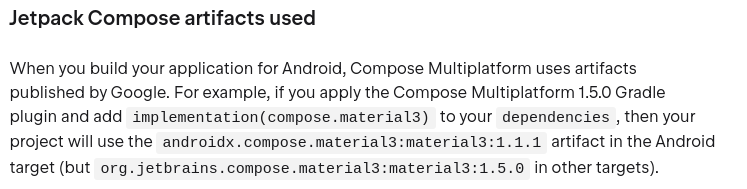

# Findings while developing the project

## Claude
- Doesn't work well with images
  - Very slow and fails on parsing some types of content(coordinates on a grid, for example)
- Can reason quite well in general
  - But isn't very proactive(follows a bad path you ask for alternatives or argue against)
  - Planning capabilities are surprisingly good
  - Was able to discover if the failing test reason is because the implementation is wrong, or if the test is wrongly defined
- Needs a good specification
- Will do the bare minimum to deliver
  - Needs constant attention to outputs
  - Already said that tests were passing once, when they clearly weren't

## Jetpack Compose
### Desktop
- Took quite some time to replicate the same behaviour as in the Android impl
  - Not as many resources as Android, lost a lot of time:
    - To identify how to create a LocalFontFamilyResolver
    - To understand that I needed a Window Composable as a root
    - Commit #d544fd97
- Bugs recognized: 
  - Scaffolding loses padding when window of the application is changed
  - ~~[CMP-8680](https://youtrack.jetbrains.com/issue/CMP-8680/Elements-partially-out-of-screen-are-not-drawn-until-resizing) - Elements partially out of screen are not drawn at first~~
    - False alarm, problem on Coil
  - [Coil-2150](https://github.com/coil-kt/coil/issues/2150) - Coil fails to load jpgs on Desktop sometimes
  - [CMP-8685](https://youtrack.jetbrains.com/issue/CMP-8685/Scaffold-Padding-is-Lost-on-Monitor-Change) - Scaffold padding lost on monitor change
- androidx.compose prefix is confusing, as both androidx.compose and org.jetbrains.compose exist 
  - Multiple androidx.compose packages work at all targets, but not *all*
  - Same libraries have different version numbers depending on if they are androidx.compose or jetbrains.compose.
    - For example, at development time, androidx material3 lib version is 1.3.2, but for jetbrains it is 1.8.2:
      - 

### Web (WASM/JS)
- WASM was harder to debug than JS/JVM
- Remember, it is still in Alpha!
- As JS is single threaded, to do requests we need to use fetch(), which needs a coroutine to be executed.
    - This demands a different way of thought for requests
- Need to call js code from Kotlin files sometimes to instantiate known types
    - [Example](app/compose/src/jsMain/kotlin/br/com/gabryel/reginaesanguine/app/util/DragAndDrop.js.kt)
- Performance and consistent processing are not guaranteed
- wasmJs failed for a long time because a single call to `whenTaskAdded` with no decent error message
  - This was caused because `whenTaskAdded` is an [eager API](https://docs.gradle.org/current/userguide/task_configuration_avoidance.html#eager_apis_to_avoid), which can cause problems.

## Multiplatform
- Potentially more slow to build than other targets, even more with multiple targets
- Tests with space in the name fail on native targets
- Multiple implementations can be very bothersome to implement per platform, as:
  - Drag and drop
  - Logging
  - Resources loading
- Multiplatform mock libs are less convenient. 
  - ~~Choose mockative:~~
    - Had to add a plugin
    - Type are autogenerated, so no calls like mock<Type>():
      - ~~[Mock class](core/build/generated/ksp/jvm/jvmTest/kotlin/br/com/gabryel/reginaesanguine/domain/CellContainerMock.kt)~~
      - ~~[Mock function implementation](core/build/generated/ksp/jvm/jvmTest/kotlin/io/mockative/br.com.gabryel.reginaesanguine.domain.CellContainer.Mockative.kt)~~
      - ~~[Workaround to allow generics](core/src/jvmTest/kotlin/br/com/gabryel/reginaesanguine/domain/helpers/MockativeConfig.kt)~~
      - [Issue on Github](https://github.com/mockative/mockative/issues/148)
    - KSP version warnings
  - Went back to mockk, as tests are jvm based at the moment

## Serialization
- Bugs recognized:
  - ~~[Spring-35281](https://github.com/spring-projects/spring-framework/issues/35281) ResponseEntity doesn't work with serialization~~ 
    - Fixed

# Interesting topics
- Serialization with Kotlinx
  - Extension ready serialization
- Jetpack Compose for multiple devices
  - Differences and difficulties
  - Kotlin/Native has no auto bundled resources and a classLoader
  - Features disappear when you add more targets
    - i.e., I only lost access to Java libs in the :app common sourceSet when I added iOS as a target
